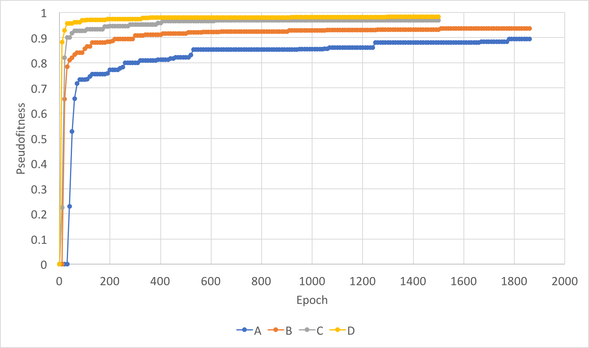

[Back To Table](../README.md)

# First Set of Runs

edf644419435b8bdef25c92d4c16642e6b0836ec

April 19-20

Based off of [the 4th generation of S_S runs](../S_S_hbond/LOG.md)

## Setup

| Run | Class 0 Weight | Class 1 Weight |
| --- | -------------- | -------------- |
|  A  | 1              | 100		|
|  B  | 1	       | 10		|
|  C  | 1	       | 3 		|
|  D  | 1	       | 1		|

| Value  | Fxn              |
| ------ | ---------------- |
| Tx     | `y = x/20`       |
| Ty     | `y = x/20`       |
| Tz     | `y = x/20`       |
| Rx     | `y = x/pi`       |
| Ry     | `y = x/pi`       |
| Rz     | `y = x - 1.6`    |
| Theta1 | `y = x - 1.6`    |
| Theta2 | `y = x - 1.6`    |
| D      | `y = (x/15) - 1` |

## Results

### Run A


### Run B


### Run C


### Run D


### Comparison

To compare the 4 runs, I am using a metric I am calling pseudofitness for lack of a better name.

```py
Pseudofitness( epoch_x ) = MAX( f(epoch_0) ... f(epoch_x) )

f( epoch_x ) =  MIN( epoch_x.positive_predictive_score, epoch_x.negative_predictive_score )
```

