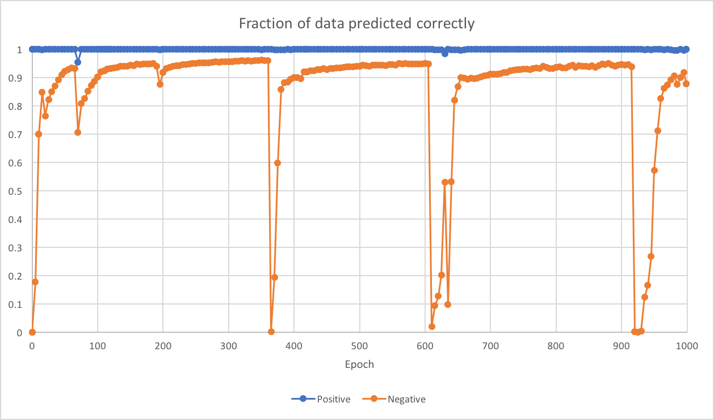
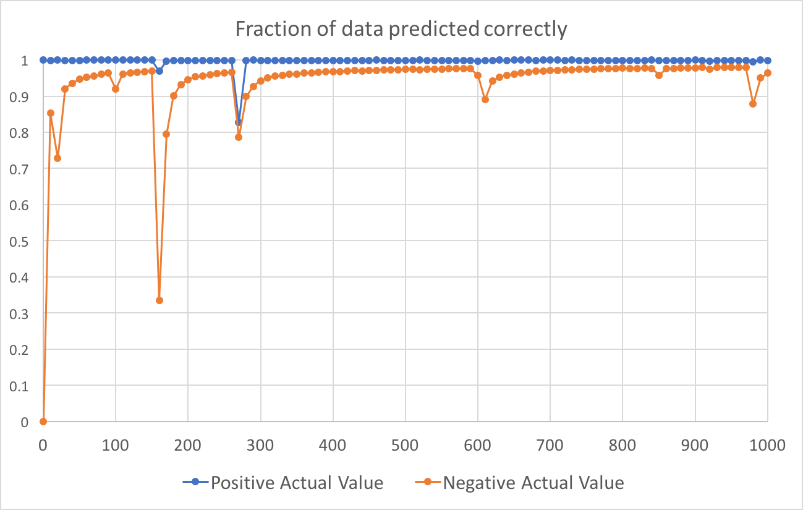

# First Set Of Runs

Somewhere around c18ba5ee3809fdca409d9b6a5639db87608e3704

Overnight April 16-17 2018

## Results:

The blue line shows the fraction of true "1" values that were predicted to be "1".
The orange line shows the fraction of true "0" values that were predicted to be "0".

Ran for 1000 epochs with 7,000,000 training data points and ~3,000,000 testing data points.




# Second Set Of Runs

372240e57fecb706075330f043c1d81fbbd781f9

Overnight April 17-18 2018

Command:
```sh
python S_S_hbond_training.boolean.batch.py --num_epochs 5000 --test_predictions test_pred.second_run.txt
```

## Changes:

- Changed rotation sampling for jump to make it more uniform (thanks to Andrew).

- Decrease class weights from 1000/1 to 100/1

- Collected new data that uses 4 ex flags and 100% Dunbrack probability

## Results:



Notable points:

| Epoch | Frac Pos | Frac Neg |
| ----- | -------- | -------- |
|   130 | 0.999428 | 0.966225 |
|   140 | 0.999357 | 0.968143 |
|   150 | 0.999214 | 0.969198 |
| | |
|   240 | 0.998878 | 0.962132 |
|   250 | 0.998807 | 0.964209 |
|   260 | 0.998807 | 0.965339 |
| | |
|   550 | 0.999021 | 0.974796 |
|   560 | 0.999035 | 0.975371 |
|   570 | 0.999121 | 0.975315 |
|   580 | 0.999000 | 0.976145 |
|   590 | 0.999050 | 0.975587 |
| | |
|   920 | 0.996628 | 0.974161 |
|   930 | 0.998985 | 0.978924 |
|   940 | 0.998978 | 0.979784 |
|   950 | 0.999064 | 0.979777 |
|   960 | 0.999150 | 0.979291 |
|   970 | 0.999128 | 0.979458 |

# Third Set of Runs

c2e094eb1dc9eabec050042a54b0aa726c903300

April 18, 2018

Command:
```sh
python S_S_hbond_training.boolean.batch.py --num_epochs 1005
```

## Changes:

- All training data is now shuffled before train_on_batch() is called