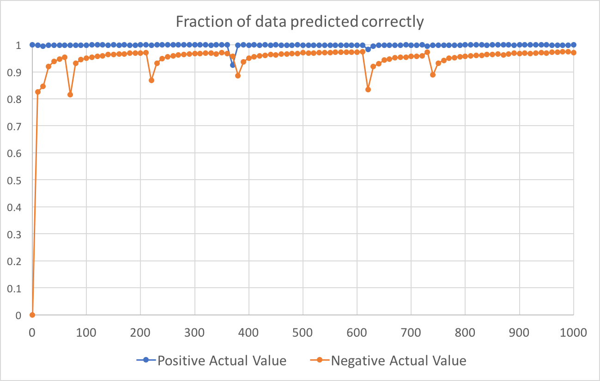
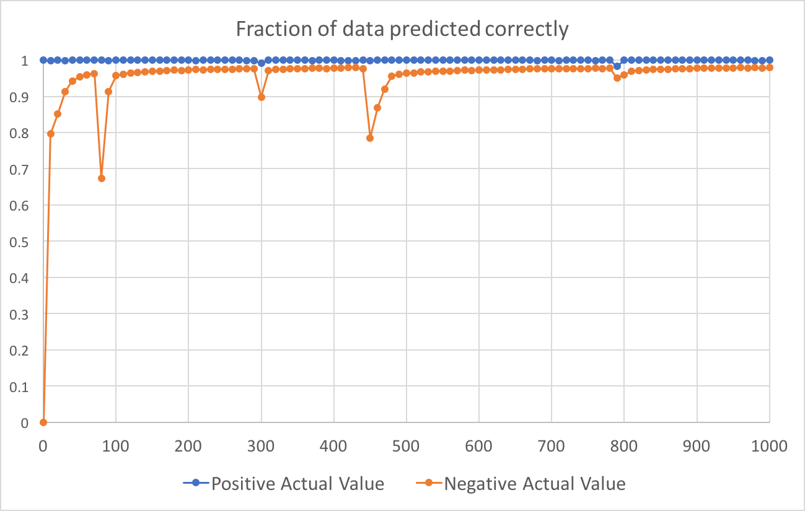
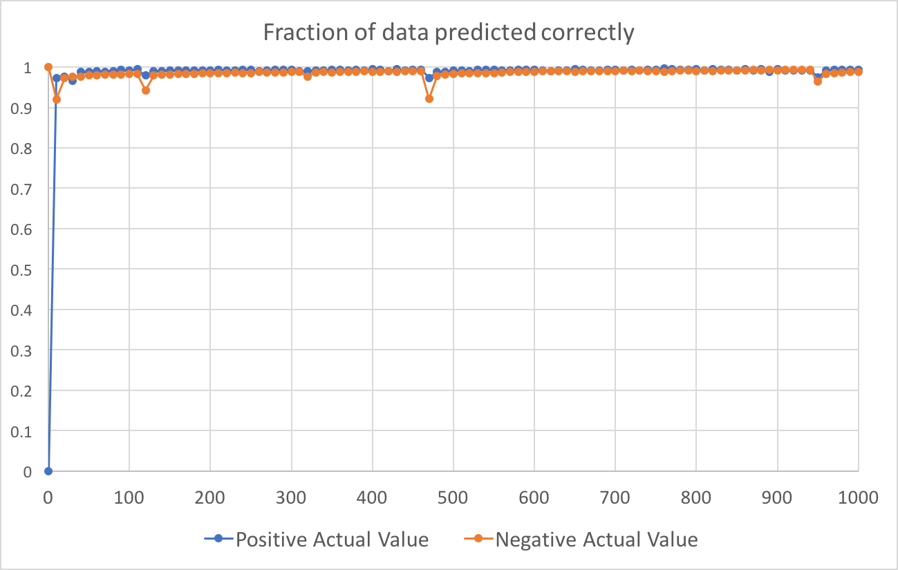
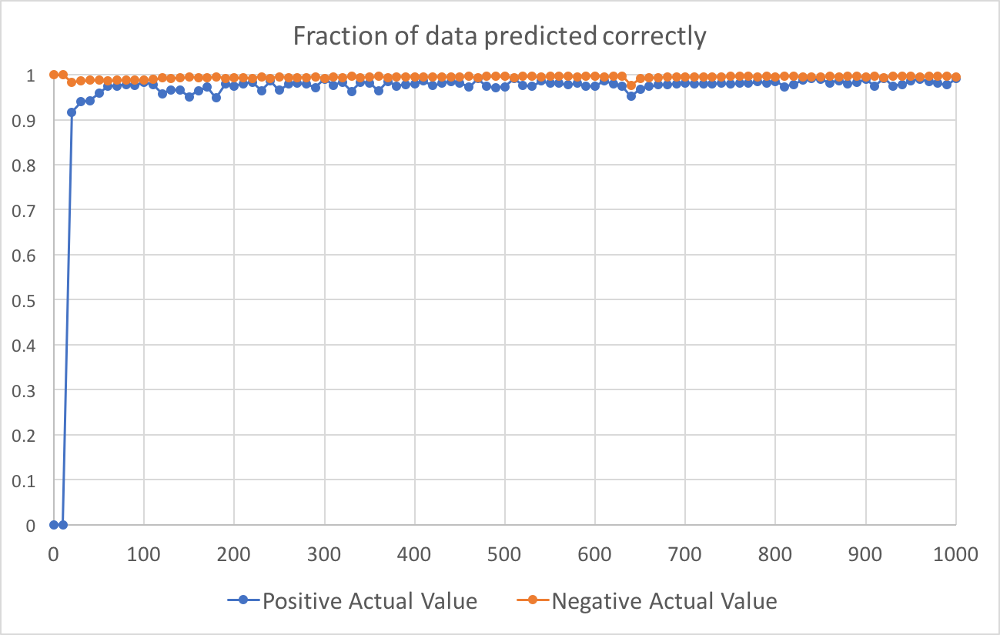
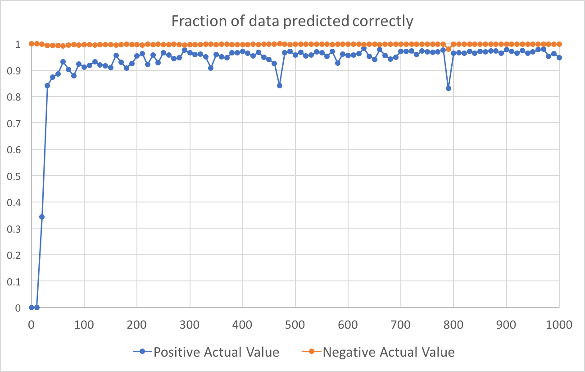

[Back To Table](../README.md)

# First Set Of Runs

Somewhere around c18ba5ee3809fdca409d9b6a5639db87608e3704

Overnight April 16-17 2018

## Results:

The blue line shows the fraction of true "1" values that were predicted to be "1".
The orange line shows the fraction of true "0" values that were predicted to be "0".

Ran for 1000 epochs with 7,000,000 training data points and ~3,000,000 testing data points.


Notable points:

| Epoch | Frac Pos | Frac Neg |
| ----- | -------- | -------- |
|   340 | 0.999170 | 0.959964 |
|   350 | 0.998989 | 0.962374 |
|   360 | 0.999245 | 0.960012 |

| Epoch | Frac Pos | Frac Neg |
| ----- | -------- | -------- |		  
|   590 | 0.999441 | 0.948047 |
|   600 | 0.999426 | 0.949833 |
|   610 | 1        | 0.020882 |

| Epoch | Frac Pos | Frac Neg |
| ----- | -------- | -------- |
|   880 | 0.999140 | 0.950444 |
|   890 | 0.999713 | 0.939725 |
|   900 | 0.999487 | 0.946965 |


# Second Set Of Runs

372240e57fecb706075330f043c1d81fbbd781f9

Succeeds: First Set

Overnight April 17-18 2018

Command:
```sh
python S_S_hbond_training.boolean.batch.py --num_epochs 5000 --test_predictions test_pred.second_run.txt
```

## Changes:

- Changed rotation sampling for jump to make it more uniform (thanks to Andrew).

- Decrease class weights from 1000/1 to 100/1

- Collected new data that uses 4 ex flags and 100% Dunbrack probability

## Results:


Notable points:

| Epoch | Frac Pos | Frac Neg |
| ----- | -------- | -------- |
|   130 | 0.999428 | 0.966225 |
|   140 | 0.999357 | 0.968143 |
|   150 | 0.999214 | 0.969198 |

| Epoch | Frac Pos | Frac Neg |
| ----- | -------- | -------- |
|   240 | 0.998878 | 0.962132 |
|   250 | 0.998807 | 0.964209 |
|   260 | 0.998807 | 0.965339 |

| Epoch | Frac Pos | Frac Neg |
| ----- | -------- | -------- |
|   570 | 0.999121 | 0.975315 |
|   580 | 0.999000 | 0.976145 |
|   590 | 0.999050 | 0.975587 |

| Epoch | Frac Pos | Frac Neg |
| ----- | -------- | -------- |
|   940 | 0.998978 | 0.979784 |
|   950 | 0.999064 | 0.979777 |
|   960 | 0.999150 | 0.979291 |
|   970 | 0.999128 | 0.979458 |


# Third Set of Runs

2643eb0080f379693af369651747ee57cd1e2ba5

Succeeds: Second Set

April 18, 2018

Command:
```sh
python S_S_hbond_training.boolean.batch.py --num_epochs 1005
```

## Changes:

- All training data is now shuffled before train_on_batch() is called


## Results:



Notable points:

| Epoch | Frac Pos | Frac Neg |
| ----- | -------- | -------- |
|   580 | 0.998950 | 0.973016 |
|   600 | 0.999042 | 0.973312 |
|   610 | 0.998921 | 0.974419 |
|   970 | 0.998864 | 0.973476 |
|   980 | 0.998707 | 0.974371 |
|   990 | 0.998593 | 0.974449 |


# Fourth Set of Runs (A-D)

899fd48cbce6096558bb8ed73603e0c790133eed

Succeeds: Third Set

April 19 (morning) - 20 (evening)

Command:
```sh
python S_S_hbond_training.boolean.batch.py --num_epochs 1005
```

## Changes:

- This generation is split into several runs,
each with a different set of class weights:

| Run | Class 0 Weight | Class 1 Weight |
| --- | -------------- | -------------- |
|  A  | 1              | 100		|
|  B  | 1	       | 10		|
|  C  | 1	       | 3 		|
|  D  | 1	       | 1		|

- At some point in Andrew Ng's youtube videos,
he mentions that input parameters should be scaled to
be roughly in the range of -1 < x < 1 with a mean of roughly 0.
I found the min and max values for each column and
created a funciton (shown below) for each column to normalize
the input parameters in this manner.

| Value  | Min   | Max  | Fxn              |
| ------ | ----- | ---- | ---------------- |
| Tx     | -20.1 | 21.7 | `y = x/20`       |
| Ty     | -28.4 | 15.4 | `y = x/20`       |
| Tz     | -18.9 | 22.2 | `y = x/20`       |
| Rx     | -3.14 | 3.14 | `y = x/pi`       |
| Ry     | -3.14 | 3.14 | `y = x/pi`       |
| Rz     | 0     | 3.12 | `y = x - 1.6`    |
| Theta1 | 0     | 3.14 | `y = x - 1.6`    |
| Theta2 | 0     | 3.14 | `y = x - 1.6`    |
| D      | 0     | 28.6 | `y = (x/15) - 1` |

## Results:

### Run A



| Epoch | Frac Pos | Frac Neg | Min    |
| ----- | -------- | -------- | ------ |
| 420   | 0.998978 | 0.979571 | 0.9795 |
| 980   | 0.998892 | 0.979374 | 0.9793 |
| 1000  | 0.999271 | 0.979264 | 0.9792 |
| 430   | 0.998985 | 0.979240 | 0.9792 |
| 960   | 0.999250 | 0.978866 | 0.9788 |
| 930   | 0.999214 | 0.978604 | 0.9786 |
| 970   | 0.999335 | 0.978554 | 0.9785 |
| 940   | 0.999250 | 0.978276 | 0.9782 |
| 400   | 0.999228 | 0.978158 | 0.9781 |
| 410   | 0.999128 | 0.978105 | 0.9781 |

### Run B



| Epoch | Frac Pos | Frac Neg | Min    |
| ----- | -------- | -------- | ------ |
| 930   | 0.992322 | 0.992686 | 0.9923 |
| 910   | 0.992165 | 0.992775 | 0.9921 |
| 870   | 0.991865 | 0.992500 | 0.9918 |
| 850   | 0.991850 | 0.992291 | 0.9918 |
| 840   | 0.993186 | 0.991587 | 0.9915 |
| 940   | 0.991558 | 0.993083 | 0.9915 |
| 900   | 0.994186 | 0.991500 | 0.9915 |
| 860   | 0.994414 | 0.991309 | 0.9913 |
| 830   | 0.993836 | 0.991224 | 0.9912 |
| 780   | 0.992822 | 0.991210 | 0.9912 |

### Run C



### Run D

